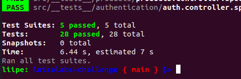
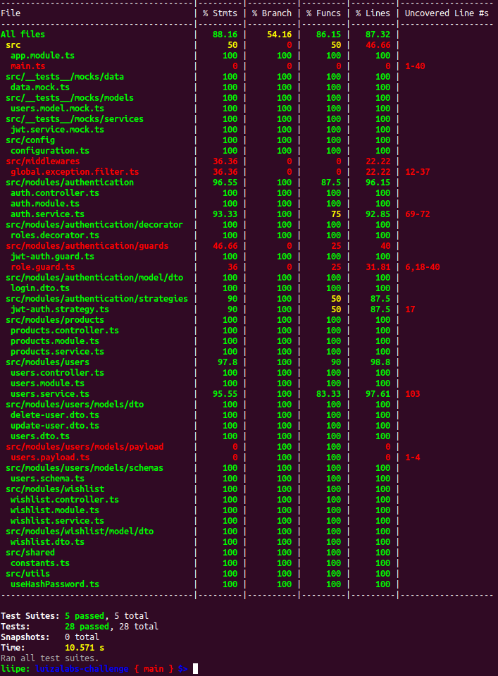

# Bem-vindo ao Desafio Técnico LuizaLabs/Magalu
Desafio Técnico para a vaga de Desenvolvedor Pleno AppSec do LuizaLabs
___

### Objetivo:

O Magalu está expandindo seus negócios e uma das novas missões do time de
tecnologia é criar uma funcionalidade de Produtos Favoritos de nossos Clientes, em
que os nossos aplicativos irão enviar requisições HTTP para um novo backend que
deverá gerenciar nossos clientes e seus produtos favoritos.
___

## Índice

- [Desenho da Aplicação](#desenho-da-aplicação)
- [Tecnologias Utilizadas](#tecnologias-utilizadas)
- [Segurança](#segurança)
- [Instalações Necessárias](#instalações-necessárias)
- [Preparando o ambiente](#preparando-o-ambiente)
- [Iniciando a Aplicação](#iniciando-a-aplicação)
- [Acesso à aplicação](#acesso-à-aplicação)
- [Documentação das Rotas](#documentação-das-rotas)
- [Módulo de Login](#módulo-de-login)
- [Módulo de Usuários](#módulo-de-usuários)
- [Módulo de Produtos](#módulo-de-produtos)
- [Módulo de Itens Favoritos](#módulo-de-itens-favoritos-wishlist)
- [Testes unitários](#testes-unitários)


___

## Desenho da Aplicação


- [Voltar ao índice](#índice)

___

## Tecnologias utilizadas

  * Docker
  * Docker-Compose
  * Nestjs + Typescript
  * Swagger
  * JWT
  * Mongoose
  * MongoDB

- [Voltar ao índice](#índice)

___

## Segurança

A aplicação foi pensada levando em conta pontos importantes da segurança como:
* Implementação de senha criptografada e validação de rotas através do token JWT.
* Tratamento correto dos parâmetros de entrada nas requisições e funcionalidades de acesso ao banco de dados evitando SQL Injection.
* Utilização da biblioteca Helmet() que é uma coleção de middelwares para Express. Ajuda a proteger uma aplicação NodeJs de várias vulnerabilidades conhecidas na web configurando cabeçalhos HTTP de forma segura
  * XSS (Cross-Site-Scripting)
  * Ataques de Injeção de Conteúdo
  * Ataques de Injeção de Dados
  * Clickjacking
  * Cache
* Controle de requisições com Throttler que atua na <b>prevenção</b> de ataques de força bruta ou negação de serviço (DoS)
* A aplicação utiliza o CORS (Cross-Origin Resource Sharing) para controlar o acesso de recursos entre diferentes origens.

- [Voltar ao índice](#índice)

___

## Instalações necessárias

Abra o terminal e navegue até onde deseja armazenar o repositório

Clone o repositório (Exemplo SSH)

```
git clone git@github.com:EddyeBoy27/luizalabs-challenge.git
```
___
É necessário que você possua o <b>Postman</b> para testar a aplicação, <b>Docker</b> e o <b>Docker-Compose</b> instalado na sua máquina pois todo o ecossistema terá seus containers orquestrados pelo <b>Docker-Compose</b>.
```
Este guia de instalação e utilização da API será realizado considerando sistemas operacionais Linux.
```
### <b>Linux</b>

[Tutorial de instalação Postman (Github)](https://gist.github.com/nunesdaniel/4baa2a09f06b1de8a55a665bb84024ab)

[Tutorial de instalação Docker (Dev.to)](https://dev.to/andersonleite/instalacao-completa-do-docker-no-ubuntu-lts-5bpi)

[Tutorial de instalação Docker-Compose (Dev.to)](https://dev.to/andersonleite/como-instalar-docker-compose-no-linux-2iin)

### <b>Windows</b>

[Tutorial de instalação Postman (Alura)](https://www.alura.com.br/artigos/postman-como-instalar-dar-seus-primeiros-passos)

[Tutorial de instalação Docker (Em inglês)](https://www.simplilearn.com/tutorials/docker-tutorial/install-docker-on-windows)

[Tutorial de instalação Docker-Compose (Em inglês)](https://www.ionos.com/digitalguide/server/configuration/install-docker-compose-on-windows/)

- [Voltar ao índice](#índice)


___

### Preparando o ambiente

Para que possamos subir a aplicação, é necessário criar no diretório do projeto um arquivo de environments (<b>.env</b>). Junto do repositório há um arquivo de environments de exemplo pronto para o uso (<b>.env.example</b>), apenas renomeio-o para <b>.env</b>

Abra o postman e importe o arquivo <b>LuizaLabs-Magalu.postman_collection.json</b> pois ele já possui todas as rotas configuradas para testar a aplicação.

- [Voltar ao índice](#índice)

___

### Iniciando a aplicação

Com o terminal aberto no diretório onde você clonou o repositório execute o seguinte comando:

```
docker-compose up
```

Caso não deseje ver os logs da aplicação (Não-recomendado) a flag (-d) roda os logs em segundo plano, não necessitando manter o terminal aberto:

```
docker-compose up -d
```

Você ainda poderá ver os logs da aplicação:

```
docker-compose logs
```
___
Com isso será instalado a imagem do banco de dados <b>MongoDB</b> e a imagem da aplicação construída com <b>NestJS</b>

O Banco de dados está configurado previamente para utilizar a porta <b>27017</b> enquanto a API utilizará a porta <b>3000</b>.
Certifique-se de ter essas portas livres na sua máquina para que não haja conflito.

Na primeira vez que subir o contâiner, será criada uma pasta <b>mongo_data</b> no diretório local do projeto que será responsável pela persistência dos dados no <b>MongoDB</b>.

Há um arquivo no diretório (init-mongo.js) que inicializará o banco de dados com um usuário possuindo uma role do tipo <b>ROLE_ADMIN</b>. Não é necessário realizar nenhuma instrução, pois o docker-compose já está configurado para a leitura do arquivo.

Você pode utilizar este usuário para logar na aplicação através do <b>Postman</b> no fluxo de <b>Login</b> ou poderá criar um novo usuário.

```

email: admin@admin.com
password: xzxgptcW1!

```

- [Voltar ao índice](#índice)


## Acesso à aplicação

A aplicação estará disponível no seguinte endpoint

```
http://localhost:3000
```

- [Voltar ao índice](#índice)

___

## Documentação das Rotas

Para acessar as rotas no <b>Postman</b> e usufruir da aplicação você deve se atentar à algumas estruturas específicas na hora de realizar a requisição de algumas rotas.

Acesse através do seu navegador a documentação detalhada da API através do <b>Swagger</b> da aplicação

```
http://localhost:3000/docs
```
- [Voltar ao índice](#índice)
___
## Módulo de Login

<b>/login</b> - POST

Rota utilizada para realizar o login na aplicação e obter um Token JWT.

Payload no body da requisição (JSON):

```
{
  "email": string
  "password": string
}
```
- [Voltar ao índice](#índice)
___
## Módulo de Usuários

<b>/users - GET</b>

Rota utilizada para visualizar todos os usuários da aplicação. 

Necessário usuário com permissão ROLE_ADMIN.

Payload da requisição:

```
{
  headers: {
    "Authorization": "Bearer <TOKENJWT>"
    "Content-type": "application/json"
  }
}
```
___
<b>/users/:id - GET</b>

Rota utilizada para listar os detalhes de um usuário.

Inserir no path da requisição o ID do usuário a ser realizado a busca.

Caso o usuário logado seja ROLE_USER, visualizará apenas os dados do próprio usuário independente do id no path da requisição.

Caso o usuário logado seja ROLE_ADMIN, poderá obter os detalhes de qualquer usuário procurado pelo id no path da requisição

Payload da requisição:

```
{
  headers: {
    "Authorization": "Bearer <TOKENJWT>"
    "Content-type": "application/json"
  }
}
```
___

<b>/users - POST</b>

Rota utilizada para criar um novo usuário.

Por padrão o usuário é criado com nível de acesso <b>ROLE_USER</b>

Payload da requisição:

```
{
  headers: {
    "Authorization": "Bearer <TOKENJWT>"
    "Content-type": "application/json"
  },
  body: {
    "name": string,
    "email": string,
    "password": string,
  }
}
```
___

<b>/users - PATCH</b>

Rota utilizada para atualizar os dados do usuário logado.

Payload da requisição:

```
{
  headers: {
    "Authorization": "Bearer <TOKENJWT>"
    "Content-type": "application/json"
  },
  body: {
    "name": string,
    "password": string,
  }
}
```
___

<b>/users - DELETE</b>

Rota utilizada para remover um usuário.

Caso o usuário tenha nível de acesso <b>ROLE_USER</b>, removerá o próprio usuário independente do id enviado no body da requisição.

Caso o usuário tenha nível de acesso <b>ROLE_ADMIN</b>, poderá remover qualquer usuário cadastrado.

Payload da requisição:

```
{
  headers: {
    "Authorization": "Bearer <TOKENJWT>"
    "Content-type": "application/json"
  },
  body: {
    "id": string,
  }
}
```

- [Voltar ao índice](#índice)

___

## Módulo de Produtos

<b>/products?page=number - GET</b>

Rota utilizada para listar todos os produtos disponíveis

Inserir a página de busca no Path da requisição
___

<b>/products/:id/ - GET</b>

Rota utilizada para realizar uma busca detalhada de um único produto.

- [Voltar ao índice](#índice)

___

## Módulo de Itens Favoritos (Wishlist)

<b>/wishlist - POST</b>

Rota utilizada para inserir um novo produto na lista de favoritos do usuário logado.

Payload da requisição:

```
{
  headers: {
    "Authorization": "Bearer <TOKENJWT>"
    "Content-type": "application/json"
  },
  body: {
    "productId": string,
  }
}
```
___

<b>/wishlist - DELETE</b>

Rota utiizada para remover um produto da lista de favoritos do usuário logado.

```
{
  headers: {
    "Authorization": "Bearer <TOKENJWT>"
    "Content-type": "application/json"
  },
  body: {
    "productId": string,
  }
}
```
- [Voltar ao índice](#índice)
___

## Testes Unitários

Para visualizar os testes unitários realizados no projeto, rode o seguinte comando no terminal:

```
npm run test
```

* Testes Totais:


___

Para visualizar o coverage, rode o seguinte comando no terminal:

```
npm run test:cov
```
___
* Coverage




- [Voltar ao índice](#índice)
